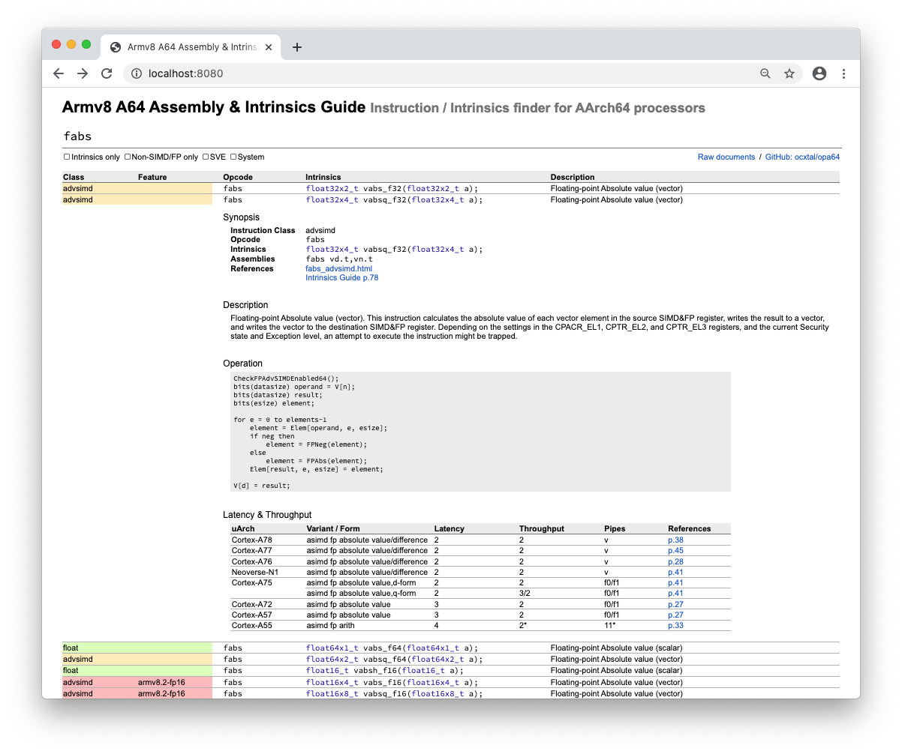

# Armv8 A64 Assembly & Intrinsics Guide Server

*— [developer.arm.com](https://developer.arm.com)に混じりてopを取りつつよろづのことに使ひけり —*



## Running in Docker

The following commands set up server at `http://localhost:8080/`.  `<path/to/db>` can be any directory outside the container where you want to save pdfs and database. Inside the container, the server script supposes the database is located at `/data`, so the path mapping would be like `-v $(pwd)/data:/data`, for example. On first launch, or more precisely if the database not found in `/data`, the script attempts to build it before starting the server. It would take a bit long, ~16min on Neoverse-N1 @2.3GHz and ~20min on Broadwell-U @2.2GHz.

```
$ docker build -t opa64server .
$ docker run -it -v <path/to/db>:/data -p 8080:8080 opa64server
```

*(You might see SSL warnings on fetching the documents.)*

## Running without Container

### Prerequisites

* Python3 for fetching, parsing, and building database
  * **[Camelot](https://github.com/camelot-dev/camelot)** for parsing pdfs, available via `pip3 install camelot-py`
    * **OpenCV** and **Ghostscript** are internal dependencies of Camelot, available via `apt install python3-opencv ghostscript` for both Arm64 and x86\_64 on Ubuntu. If you are on x86\_64, you'll have some more alternative choices for OpenCV, such as `pip3 install opencv-python`.
  * **Requests** for fetching documents, available via `pip3 install requests`.
* You might need to install **libgs** as the backend of the python ghostscript library. Available via `brew install ghostscript` on macOS or `apt install libgs-dev` on Ubuntu.

### Run

`make db` builds the database in `data` directory and `make run` starts server at `http://localhost:8080/`.

```bash
$ make db
python3 opa64.py fetch --doc=all --dir=data
python3 opa64.py parse --doc=all --dir=data > data/db.raw.json
python3 opa64.py split --db data/db.raw.json > data/db.json
$ make start
python3 -m http.server 8080
```

## List of Document Resources

The script downloads the following documents. Currently the links are maintained manually so they might be behind the latest. Fixing them by issue or pull request is always welcome.

* **"Arm A64 Instruction Set Architecture"** for descriptions of instructions: https://developer.arm.com/-/media/developer/products/architecture/armv8-a-architecture/2020-03/A64_ISA_xml_v86A-2020-03.tar.gz
* **"Arm C Language Extensions Documentation"** for feature macros: https://static.docs.arm.com/101028/0011/ACLE_Q2_2020_101028_Final.pdf
* **"Arm Neon Intrinsics Reference for ACLE"** for C/C++ intrinsics: https://static.docs.arm.com/ihi0073/e/IHI0073E_arm_neon_intrinsics_ref.pdf
* **"Software Optimization Guides"** for latency & throughput tables
  * X1: [https://documentation-service.arm.com/static/5f15a74720b7cf4bc5247c06?token=]
  * A78: https://static.docs.arm.com/102160/0300/Arm_Cortex-A78_Core_Software_Optimization_Guide.pdf
  * A77: https://static.docs.arm.com/swog011050/c/Arm_Cortex-A77_Software_Optimization_Guide.pdf
  * A76: https://static.docs.arm.com/swog307215/a/Arm_Cortex-A76_Software_Optimization_Guide.pdf
  * N1: https://static.docs.arm.com/swog309707/a/Arm_Neoverse_N1_Software_Optimization_Guide.pdf
  * A75: https://static.docs.arm.com/101398/0200/arm_cortex_a75_software_optimization_guide_v2.pdf
  * A72: https://static.docs.arm.com/uan0016/a/cortex_a72_software_optimization_guide_external.pdf
  * A57: https://static.docs.arm.com/uan0015/b/Cortex_A57_Software_Optimization_Guide_external.pdf
  * A55: https://static.docs.arm.com/epm128372/30/arm_cortex_a55_software_optimization_guide_v3.pdf

## Notes

This is an unofficial project providing an alternative tool to [the official NEON intrinsics guide](https://developer.arm.com/architectures/instruction-sets/simd-isas/neon/intrinsics). The main difference to the official one is it collects and gives non-NEON instructions, latency & throughput tables, and links to the original (detailed) html and pdf documents. Please make sure this is an unofficial one and not intended to be used as primary information, and the parsing result is not guaranteed to be correct.

## Copyright and License

Large portion of the styles and codes in `opv86.css` and `index.html`, and some lines in `opv86.js` and `Makefile` were derived from [hikalium/opv86](https://github.com/hikalium/opv86). All the others in this repository except for `jquery.min.js` were written by Hajime Suzuki (@ocxtal). Everything in this repository is licensed under MIT (as in opv86). Note that **any document or content under developer.arm.com, including static.docs.arm.com, is not allowed for redistribution** according to [the license terms of the website](https://www.arm.com/en/company/policies/terms-and-conditions#our-content).

